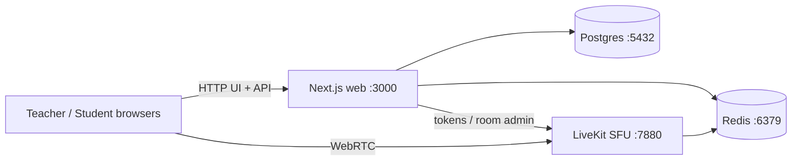

# Classroom — Live Online Teaching (MVP)

Privacy-minded live classes: teachers sign in, students join with a room code, waiting-room admit, **selective student video** (only a rotating sample publishes to LiveKit), screen share with annotations, **in-class chat** (student→teacher + teacher broadcast/DM), screen share, mute controls. **No recording.**

## Architecture



| Service | Role |
|---------|------|
| **web** | Next.js 14 App Router — teacher/student UI, auth, room APIs, sample rotation |
| **livekit** | Open-source WebRTC SFU |
| **postgres** | Teachers, rooms, participants, chat messages |
| **redis** | Waiting/admitted sets, visible-sample identities, screen-annotate snapshots |

> **Networking:** `docker-compose.yml` uses `network_mode: host` on a single Linux VM so LiveKit WebRTC UDP/TCP bind on the host NICs and services talk over `127.0.0.1`. Ideal for local demos **and** bare public-IP VPS deploys (see [docs/DEPLOY-VPS.md](docs/DEPLOY-VPS.md)). Optional **Caddy** TLS uses the same host networking via Compose profile `tls` ([docs/DEPLOY-CADDY.md](docs/DEPLOY-CADDY.md)).

### How sampled video works

1. Every admitted student may keep **camera on locally** (preview on their device).
2. Redis holds a **visible sample** of size `N` (`MAX_VISIBLE_STUDENT_VIDEOS`, default **6** (hard max **6**), overridable per room).
3. Only students whose LiveKit identity is in that set **publish** camera tracks to LiveKit.
4. The server **rotates** the sample every `SAMPLE_ROTATION_SECONDS` (default **8**), or when the teacher clicks **Rotate sample**.
5. When a **student speaks**, the teacher client pins them into the visible sample (`POST /api/rooms/{code}/sample/pin`) so their camera publishes; pins last ~18s and are preferred during random rotation.
6. Teachers can **Mute all students** / **Unmute all**; students muted by the teacher cannot unmute themselves.
7. **Chat** (sidebar): students message the teacher only; teachers broadcast to everyone or DM one student. History lives in Postgres for the life of the class (cleared from API when room is ENDED). LiveKit `chat` topic + 2s poll.
8. UI always shows **“In class · may be visible”** so students feel present even when not in the sample.
9. **Audio** and **screen share** are not limited by the sample (teacher mute still applies).

Non-sampled video **never leaves the student device**.

### Student live view

Students get a fullscreen exclusive stage — teacher screen share when active (not a student video grid; no screen-share control for students):

- **Floating teacher camera** in the corner (subscribes to the teacher cam track; avatar placeholder when off)
- **Always-visible floating controls** — mic, cam, chat, leave
- Chat opens as a side drawer over the stage
- Waiting state when the teacher has not started screen share yet

If no webcam is available, the app falls back to a **canvas demo camera** so publish/preview still works in headless or permission-denied environments.

On the waiting-room screen, **Not you? Join with a different name** calls `POST /api/auth/clear-student` to drop the student session cookie so another display name can join in the same browser.

### Teach while sharing

When the teacher shares their screen and needs to switch to another app, the
**Share HUD** keeps every class control reachable. It auto-opens when the share
starts and floats in its own window:

- **Annotate** on top of the shared screen (pen / highlighter / eraser / clear).
  Students see the strokes composited over the share, on the `screen` stage —
  annotations draw on the shared screen (no separate whiteboard).
- **Chat** (teacher rules unchanged), **raised hands** with Lower, and
  **per-student mute** plus mute-all / unmute-all.

Hosts are chosen automatically: **Document Picture-in-Picture** (Chromium 116+,
always-on-top) → **`window.open` popup** (other desktop browsers; you may need to
raise it manually) → **in-page bottom sheet** (mobile, or when both are blocked).
The collapsed sheet is a small pill, so it never covers the whole screen.

Details, browser matrix and limitations: **[SHARE_HUD_NOTES.md](SHARE_HUD_NOTES.md)**.

### Students are muted while the teacher is away

Whenever the teacher is **not connected** to the LiveKit room (not joined yet,
left, or lost internet), every student is force-muted: the SFU grant has no
microphone, so a student cannot unmute even with a modified client. The student
mic button shows **"Mic locked — teacher not in class"**. When the teacher is
back, students stay muted until they unmute themselves; a teacher mute
(per-student or Mute all) still wins. Presence comes from the live LiveKit
connection via a **LiveKit webhook** — `infra/livekit.yaml` must contain the
`webhook:` block (re-run `./scripts/sync-livekit-keys.sh`). Details:
**[docs/TEACHER_PRESENCE_MIC_LOCK.md](docs/TEACHER_PRESENCE_MIC_LOCK.md)**.

## Media quality

Defined in `apps/web/src/lib/videoQuality.ts`:

| Track | Capture | Encoding |
|---|---|---|
| Teacher camera | 1280×720, 30 fps | simulcast 320×180 @15 fps ≤140 kbps · 640×360 @24 fps ≤500 kbps · 720p @30 fps ≤1.5 Mbps |
| Student camera | 320×180, 15 fps | single layer ≤200 kbps |
| Screen share | up to 1920×1080, 15 fps | simulcast 1280×720 @10 fps ≤500 kbps · captured size (≤1080p) @15 fps ≤1.5 Mbps; single layer when the capture's short side is under 900 px, on Firefox publishers, or if the layered publish fails |

Subscribers use `adaptiveStream` (the SFU forwards the layer that fits the
element, kept playing in background tabs) and publishers use `dynacast`
(unreceived layers are not encoded).
The screen share's low layer stays at 720p (not 540p) so slide text remains
legible on phones and small windows; full-screen students on ≥1080-line
displays (or HiDPI) receive the 1080p layer, the admin tiles the 720p one.

## School management

- **Admin** (`/admin`, one account bootstrapped from `ADMIN_EMAIL`): creates
  teachers and assigns them grades/divisions, maintains the weekly
  **timetable** (`/admin/timetable`) and one-off changes. **Ongoing classes**
  (`/admin/live`): live muted tiles of what students see in every running class
  (elapsed time, students connected); click one to sit in as a hidden,
  listen-only observer. See **[docs/ADMIN_ONGOING_CLASSES.md](docs/ADMIN_ONGOING_CLASSES.md)**.
- **Timetable**: weekly slots (teacher, grade, one or more divisions or ALL
  divisions, subject, weekday, start/end, optional term dates) in
  `APP_TIMEZONE` (default Asia/Kolkata). One-off changes: cancel a date,
  substitute teacher / new time / subject, or an extra class. A teacher can
  never have two overlapping slots; a grade-division overlap needs the admin
  to confirm.
- **Teacher dashboard**: today's and the next 6 days' classes. **Start class**
  is enabled from `WAITING_ROOM_EARLY_MINUTES` (default 10) before the start
  until the end; starting the same class again that day reuses the same class
  session. **Ad-hoc classes** are allowed outside the timetable, only for the
  teacher's assigned grades/divisions. A teacher runs one class at a time in
  their permanent room (code unchanged); starting another class ends the
  previous one.
- Every class is recorded as a `ClassSession` (slot + date, or ad-hoc;
  teacher, grade, divisions, scheduled and actual start/end).
- **Students join only from the school app** via a signed, single-use,
  ≤120 s link `GET /join?t=<JWT>` (EdDSA/RS256 public key preferred, HS256
  secret fallback; see **[docs/SCHOOL_APP_INTEGRATION.md](docs/SCHOOL_APP_INTEGRATION.md)**).
  The school's student ID is the identity key; roll number is display only.
  The student is routed to the class open now for their grade-division
  (combined / all-division and ad-hoc classes included), a countdown for a
  later class today, or "no class right now". They still wait for the teacher
  to admit them; the roster shows name, roll no, grade-division, timetable and
  late badges. A student session cannot enter another grade-division's class.
  Manual code + name join is off (`ALLOW_MANUAL_STUDENT_JOIN=false`; dev only).
- **Attendance** per student per class: first joined, admitted, left, total
  connected time (LiveKit webhook joins/leaves, union across reconnects and
  duplicate tabs), late (after start + `LATE_GRACE_MINUTES`), status
  present / late / waited-not-admitted / absent. Admin → **Attendance**
  (`/admin/reports`): per class (scheduled vs actual start, counts, classes not
  held), per student (percentage) and detail, filter by dates, teacher, grade,
  division, subject, CSV export of each. Teachers see their own classes at
  `/teacher/attendance`.
- **Absent is only known for known students**: a student exists in the system
  after their first signed join, or after the admin imports the roster
  (Admin → **Students**, CSV `externalId,name,grade,division,roll`).

## Quick start

### Prerequisites

- Docker Engine + Compose plugin
- Ports free: **3000** (web), **5432** (Postgres), **6379** (Redis), **7880/7881** (LiveKit), **50000–50100/udp** (WebRTC)

### Secrets (read this before deploying)

- `LIVEKIT_API_KEY` / `LIVEKIT_API_SECRET`, `NEXTAUTH_SECRET` and `POSTGRES_PASSWORD`
  live only in the untracked `.env`. `scripts/sync-livekit-keys.sh` (also run by
  the `configure-*.sh` scripts) replaces missing values, placeholders, the old
  `devkey` key, and any value known to have leaked from this repo's git history
  with fresh random ones. It never prints them. `ROTATE_SECRETS=1
  ./scripts/sync-livekit-keys.sh` forces a full rotation.
- `infra/livekit.yaml` is **generated and gitignored** (template:
  `infra/livekit.example.yaml`). Never commit it: an early version of this repo
  committed a real LiveKit secret, which is why any deployment created before
  2026-09-30 must rotate (see `docs/DEPLOY-VPS.md` → "Upgrading an existing server").
- The web container refuses to start when a LiveKit or NextAuth secret is
  missing, a placeholder or a known-leaked value.

### Run

```bash
cd classroom   # or: git clone … && cd classroom

./scripts/sync-livekit-keys.sh   # creates .env if needed, generates fresh secrets,
                                 # writes the (gitignored) infra/livekit.yaml

docker compose up --build -d
```

Health check:

```bash
curl -s http://localhost:3000/api/health
# expect: "status":"healthy"
```

### Demo in two browsers

1. **Admin** → set `ADMIN_EMAIL` in `.env`, run `./scripts/create-admin.sh`, read the
   generated password from `secrets/admin-initial-password`, sign in at
   http://localhost:3000/login (you must set a new password) and add a teacher at `/admin`.
   **Teacher** → sign in with the temporary password shown to the admin (must be changed).
   Public self-registration was removed; `/register` redirects to `/login`.
2. Dashboard → **Start class** → you land directly in the classroom (camera starts off; turn it on from the dock)
3. In the classroom header: **Copy invite link** / **Copy code**
4. **Student** (incognito / second browser) → a signed test link from
   `node apps/web/scripts/make-join-link.mjs …` (see docs/SCHOOL_APP_INTEGRATION.md §6) → waiting room.
   (Or set `ALLOW_MANUAL_STUDENT_JOIN=true` for the old http://localhost:3000/join/{CODE} → name flow.)
5. Teacher **N waiting · Admit** (or Roster → Admit / Admit all) → student enters class (floating teacher cam + float controls)
6. Try **Chat**, mute / mute-all, screen share + annotate, **Rotate sample**, speak as a student to force pin into sample

### Stop

```bash
docker compose down
# wipe data volumes:
docker compose down -v
```


## Deploy on a VPS (public IP, no domain)

```bash
cp -n .env.example .env
PUBLIC_IP=203.0.113.10 ./scripts/configure-public-ip.sh   # your VM public IPv4
./scripts/sync-livekit-keys.sh
docker compose up --build -d
```

Open `http://PUBLIC_IP:3000`. Firewall must allow **3000/tcp**, **7880/tcp**, **7881/tcp**, and **50000–50100/udp**. Full steps: [docs/DEPLOY-VPS.md](docs/DEPLOY-VPS.md).

## Deploy with HTTPS (Caddy + Let's Encrypt)

Needs a **hostname** (not `https://1.2.3.4`). Use your domain, or a free IP name from [sslip.io](https://sslip.io) (e.g. `81-223-254-76.sslip.io` → `81.223.254.76`).

**Own domain:**

```bash
DOMAIN=class.example.com PUBLIC_IP=203.0.113.10 ACME_EMAIL=admin@example.com \
  ./scripts/configure-domain-tls.sh
./scripts/sync-livekit-keys.sh
docker compose --profile tls up --build -d
```

**No domain (sslip.io):**

```bash
PUBLIC_IP=81.223.254.76 ACME_EMAIL=admin@example.com \
  ./scripts/configure-sslip-tls.sh
./scripts/sync-livekit-keys.sh
docker compose --profile tls up --build -d
```

Opens `https://…` and `wss://livekit.…`. Firewall: **80/443**, **7881/tcp**, **50000–50100/udp**; do **not** expose **3000** or **7880** publicly. Full steps: [docs/DEPLOY-CADDY.md](docs/DEPLOY-CADDY.md).


## URLs & ports

| URL | Purpose |
|-----|---------|
| http://localhost:3000 | Web app |
| http://localhost:3000/login | Admin + teacher login |
| http://localhost:3000/admin | School admin (teachers) |
| http://localhost:3000/admin/timetable | Weekly timetable + one-off changes |
| http://localhost:3000/admin/live | Ongoing classes (live previews, observe) |
| http://localhost:3000/join | Student join (enter code) |
| http://localhost:3000/join/{CODE} | Direct join link |
| http://localhost:3000/api/health | Health check |
| http://localhost:3000/api/auth/clear-student | `POST` — clear student cookie (rejoin as different name) |
| ws://localhost:7880 | LiveKit WebSocket |

## Environment variables

See `.env.example`. Important:

| Variable | Default | Meaning |
|----------|---------|---------|
| `MAX_VISIBLE_STUDENT_VIDEOS` | `6` | Default sample size for new rooms (hard-capped at 6) |
| `SAMPLE_ROTATION_SECONDS` | `8` | Auto-rotation interval for visible student cameras (5–10s recommended) |
| `SPEAKER_PIN_TTL_SECONDS` | `18` | How long an active-speaker pin protects a student from random ejection |
| `LIVEKIT_API_KEY` / `LIVEKIT_API_SECRET` | generated | Admin credential for the SFU. Generated into `.env` and the gitignored `infra/livekit.yaml` by `scripts/sync-livekit-keys.sh` |
| `APP_URL` / `NEXT_PUBLIC_APP_URL` | `http://localhost:3000` | Browser-facing app origin — `http://PUBLIC_IP:3000` (bare IP) or `https://DOMAIN` (Caddy) |
| `NEXT_PUBLIC_LIVEKIT_URL` | `ws://localhost:7880` | Browser-facing LiveKit — `ws://PUBLIC_IP:7880` or `wss://livekit.DOMAIN` |
| `DOMAIN` / `ACME_EMAIL` | _(unset)_ | Domain TLS via `configure-domain-tls.sh`; optional LE account email |
| `LIVEKIT_WEBHOOK_URL` | `http://127.0.0.1:3000/api/livekit/webhook` | Where LiveKit posts room/participant events (teacher presence → student mic lock). Written into `infra/livekit.yaml` by `sync-livekit-keys.sh` |
| `LIVEKIT_USE_EXTERNAL_IP` | `false` | `true` on VPS so ICE advertises the public IP (`sync-livekit-keys.sh`) |
| `LIVEKIT_NODE_IP` | _(unset)_ | Optional pin of advertised IP (set by configure-public-ip / configure-domain-tls) |
| `COOKIE_SECURE` | derived from `APP_URL` | `false` for HTTP / bare IP; `true` behind HTTPS (Caddy) |
| `NEXTAUTH_SECRET` | generated | JWT signing for admin / teacher sessions |
| `APP_TIMEZONE` | `Asia/Kolkata` | Time zone of the timetable |
| `WAITING_ROOM_EARLY_MINUTES` | `10` | A timetabled class can be opened / its waiting room opens this many minutes early |
| `LATE_GRACE_MINUTES` | `5` | Students arriving later than class start + this are marked late |
| `SCHOOL_APP_JWT_ISSUER` | _(unset)_ | Required `iss` of school-app join tokens (joining is disabled until set) |
| `SCHOOL_APP_JWT_PUBLIC_KEY` / `SCHOOL_APP_JWT_PUBLIC_KEY_FILE` | _(unset)_ | School app's Ed25519/RSA public key (PEM). Preferred; disables HS256 |
| `SCHOOL_APP_JWT_SECRET` | _(unset)_ | HS256 shared secret, only used when no public key is set |
| `SCHOOL_APP_JWT_AUDIENCE` | `classroom` | Required `aud` |
| `SCHOOL_APP_JWT_MAX_LIFETIME_SECONDS` / `_CLOCK_SKEW_SECONDS` | `120` / `30` | Max `exp − iat`; clock tolerance |
| `ALLOW_MANUAL_STUDENT_JOIN` | `false` | Dev/testing: allow the old code + name student join |
| `ADMIN_EMAIL` | _(unset)_ | Email of the single school admin, created on first boot or by `scripts/create-admin.sh` (generated password → `./secrets/admin-initial-password`) |
| `DATABASE_URL` | `postgresql://…@127.0.0.1:5432/…` | Host-network Postgres |
| `REDIS_URL` | `redis://127.0.0.1:6379` | Host-network Redis |

## Project layout

```
.
├── docker-compose.yml          # host networking stack (+ optional profile tls / Caddy)
├── .env.example                # copy to .env (gitignored)
├── infra/livekit.example.yaml  # template; infra/livekit.yaml is generated + gitignored
├── infra/Caddyfile             # written by configure-domain-tls.sh
├── scripts/sync-livekit-keys.sh
├── scripts/configure-public-ip.sh
├── scripts/configure-domain-tls.sh
├── docs/DEPLOY-VPS.md          # bare public-IP VPS guide
├── docs/DEPLOY-CADDY.md        # domain + Caddy Let's Encrypt
├── README.md
└── apps/web                    # Next.js app
    ├── Dockerfile
    ├── prisma/
    └── src/
        ├── app/                # pages + API routes
        ├── components/classroom/
        ├── hooks/
        └── lib/                # db, redis, auth, livekit, sample
```

## Key implementation files

| File | Purpose |
|------|---------|
| `apps/web/src/lib/sample.ts` | Visible-sample rotation in Redis |
| `apps/web/src/components/classroom/ClassroomRoom.tsx` | LiveKit room, selective publish, student float UI |
| `apps/web/src/app/api/auth/clear-student/route.ts` | Clear student cookie for rejoin |
| `apps/web/src/app/api/rooms/[code]/*/route.ts` | Join, admit, token, mute, state, end |
| `apps/web/src/components/classroom/Chat.tsx` | In-class messaging UI |
| `apps/web/src/app/api/rooms/[code]/messages/route.ts` | Chat GET/POST (scoped visibility) |

## Scale design notes

Targets: ~20 concurrent rooms × ~150 attendees. Selective publish is the main lever: at most `N` student cameras + teacher media hit the SFU per room instead of 150 uplink videos.

## Versions

- **LiveKit server:** `livekit/livekit-server:v1.12.0` (aligned with `livekit-client` 2.x)
- **livekit-client:** `^2.6` (resolves to 2.22.x in lockfile)

## Known limitations (MVP)

- Screen-share annotations use **LiveKit reliable data messages** plus a Redis snapshot for late joiners.
- Chat persists in Postgres while the room is LIVE/WAITING; GET returns empty after ENDED. No student-to-student chat.
- Local demos keep `use_external_ip: false`; VPS deploys set it `true` (and usually `LIVEKIT_NODE_IP`) via `configure-public-ip.sh`.
- Bare HTTP on a public IP works (cookies `Secure=false`); browsers may still warn about camera/mic permissions compared to HTTPS. Prefer domain + Caddy (`--profile tls`) for production.
- No built-in TURN — restrictive NATs may need a TURN server for media.
- No recording (by design).
- Student sessions are cookie-bound to the joining browser (`POST /api/auth/clear-student` to switch names).
- Absent counts cover only students known to the classroom (first signed join or roster import).
- Connected time comes from LiveKit webhooks; if the webhook is not reachable, attendance still records waiting-room arrival, admission and explicit leave, but connected minutes stay 0.
- Compose uses **host** networking on a single VM (best for LiveKit UDP on a public IP).

## License

Open-source stack (Next.js, LiveKit, Postgres, Redis). App code provided as-is for this MVP.
