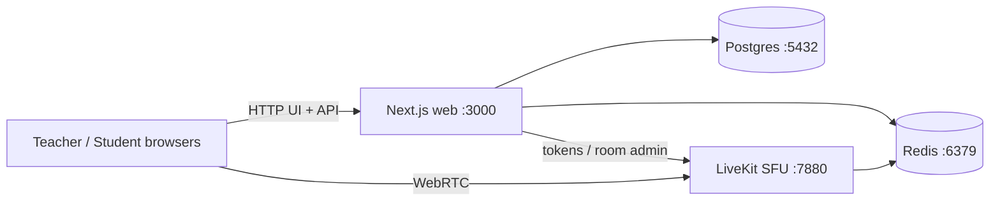

# Classroom — Live Online Teaching (MVP)

Privacy-minded live classes: teachers sign in, students join with a room code, waiting-room admit, **selective student video** (only a rotating sample publishes to LiveKit), shared tldraw whiteboard, **in-class chat** (student→teacher + teacher broadcast/DM), screen share, mute controls. **No recording.**

## Architecture



| Service | Role |
|---------|------|
| **web** | Next.js 14 App Router — teacher/student UI, auth, room APIs, sample rotation |
| **livekit** | Open-source WebRTC SFU |
| **postgres** | Teachers, rooms, participants, chat messages |
| **redis** | Waiting/admitted sets, visible-sample identities, whiteboard snapshots |

> **Networking:** `docker-compose.yml` uses `network_mode: host` on a single Linux VM so LiveKit WebRTC UDP/TCP bind on the host NICs and services talk over `127.0.0.1`. Ideal for local demos **and** bare public-IP VPS deploys (see [docs/DEPLOY-VPS.md](docs/DEPLOY-VPS.md)). Optional **Caddy** TLS uses the same host networking via Compose profile `tls` ([docs/DEPLOY-CADDY.md](docs/DEPLOY-CADDY.md)).

### How sampled video works

1. Every admitted student may keep **camera on locally** (preview on their device).
2. Redis holds a **visible sample** of size `N` (`MAX_VISIBLE_STUDENT_VIDEOS`, default **10**, overridable per room).
3. Only students whose LiveKit identity is in that set **publish** camera tracks to LiveKit.
4. The server **rotates** the sample every `SAMPLE_ROTATION_SECONDS` (default **8**), or when the teacher clicks **Rotate sample**.
5. When a **student speaks**, the teacher client pins them into the visible sample (`POST /api/rooms/{code}/sample/pin`) so their camera publishes; pins last ~18s and are preferred during random rotation.
6. Teachers can **Mute all students** / **Unmute all**; students muted by the teacher cannot unmute themselves.
7. **Chat** (sidebar): students message the teacher only; teachers broadcast to everyone or DM one student. History lives in Postgres for the life of the class (cleared from API when room is ENDED). LiveKit `chat` topic + 2s poll.
8. UI always shows **“In class · may be visible”** so students feel present even when not in the sample.
9. **Audio** and **screen share** are not limited by the sample (teacher mute still applies).

Non-sampled video **never leaves the student device**.

### Student live view

Students get a fullscreen exclusive stage — **either** teacher screen share **or** whiteboard (not a student video grid; no screen-share control for students):

- **Floating teacher camera** in the corner (subscribes to the teacher cam track; avatar placeholder when off)
- **Always-visible floating controls** — mic, cam, chat, leave
- Chat opens as a side drawer over the stage
- Waiting state when the teacher has not started screen/whiteboard yet

If no webcam is available, the app falls back to a **canvas demo camera** so publish/preview still works in headless or permission-denied environments.

On the waiting-room screen, **Not you? Join with a different name** calls `POST /api/auth/clear-student` to drop the student session cookie so another display name can join in the same browser.

## Quick start

### Prerequisites

- Docker Engine + Compose plugin
- Ports free: **3000** (web), **5432** (Postgres), **6379** (Redis), **7880/7881** (LiveKit), **50000–50100/udp** (WebRTC)

### Run

```bash
cd classroom   # or: git clone … && cd classroom

cp -n .env.example .env   # only if you need a fresh copy
./scripts/sync-livekit-keys.sh   # writes LIVEKIT_* into infra/livekit.yaml

docker compose up --build -d
```

Health check:

```bash
curl -s http://localhost:3000/api/health
# expect: "status":"healthy"
```

### Demo in two browsers

1. **Teacher** → http://localhost:3000/login  
   - Seeded demo (from smoke test): `teacher@example.com` / `password123`  
   - Or register a new account at `/register`
2. Dashboard → **Create room** → copy join code/link
3. Teacher lobby → **Enter classroom** (allow camera/mic)
4. **Student** (incognito / second browser) → http://localhost:3000/join/{CODE} → name → waiting room
5. Teacher **Admit** → student enters class (floating teacher cam + float controls)
6. Try whiteboard, **Chat**, mute / mute-all, screen share, **Rotate sample**, speak as a student to force pin into sample

### Stop

```bash
docker compose down
# wipe data volumes:
docker compose down -v
```


## Deploy on a VPS (public IP, no domain)

```bash
cp -n .env.example .env
PUBLIC_IP=203.0.113.10 ./scripts/configure-public-ip.sh   # your VM public IPv4
./scripts/sync-livekit-keys.sh
docker compose up --build -d
```

Open `http://PUBLIC_IP:3000`. Firewall must allow **3000/tcp**, **7880/tcp**, **7881/tcp**, and **50000–50100/udp**. Full steps: [docs/DEPLOY-VPS.md](docs/DEPLOY-VPS.md).

## Deploy with HTTPS (Caddy + Let's Encrypt)

Needs a **hostname** (not `https://1.2.3.4`). Use your domain, or a free IP name from [sslip.io](https://sslip.io) (e.g. `81-223-254-76.sslip.io` → `81.223.254.76`).

**Own domain:**

```bash
DOMAIN=class.example.com PUBLIC_IP=203.0.113.10 ACME_EMAIL=admin@example.com \
  ./scripts/configure-domain-tls.sh
./scripts/sync-livekit-keys.sh
docker compose --profile tls up --build -d
```

**No domain (sslip.io):**

```bash
PUBLIC_IP=81.223.254.76 ACME_EMAIL=admin@example.com \
  ./scripts/configure-sslip-tls.sh
./scripts/sync-livekit-keys.sh
docker compose --profile tls up --build -d
```

Opens `https://…` and `wss://livekit.…`. Firewall: **80/443**, **7881/tcp**, **50000–50100/udp**; do **not** expose **3000** or **7880** publicly. Full steps: [docs/DEPLOY-CADDY.md](docs/DEPLOY-CADDY.md).


## URLs & ports

| URL | Purpose |
|-----|---------|
| http://localhost:3000 | Web app |
| http://localhost:3000/register | Teacher registration |
| http://localhost:3000/login | Teacher login |
| http://localhost:3000/join | Student join (enter code) |
| http://localhost:3000/join/{CODE} | Direct join link |
| http://localhost:3000/api/health | Health check |
| http://localhost:3000/api/auth/clear-student | `POST` — clear student cookie (rejoin as different name) |
| ws://localhost:7880 | LiveKit WebSocket |

## Environment variables

See `.env.example`. Important:

| Variable | Default | Meaning |
|----------|---------|---------|
| `MAX_VISIBLE_STUDENT_VIDEOS` | `10` | Default sample size for new rooms |
| `SAMPLE_ROTATION_SECONDS` | `8` | Auto-rotation interval for visible student cameras (5–10s recommended) |
| `SPEAKER_PIN_TTL_SECONDS` | `18` | How long an active-speaker pin protects a student from random ejection |
| `LIVEKIT_API_KEY` / `LIVEKIT_API_SECRET` | generated | Must match `infra/livekit.yaml` (`scripts/sync-livekit-keys.sh`) |
| `APP_URL` / `NEXT_PUBLIC_APP_URL` | `http://localhost:3000` | Browser-facing app origin — `http://PUBLIC_IP:3000` (bare IP) or `https://DOMAIN` (Caddy) |
| `NEXT_PUBLIC_LIVEKIT_URL` | `ws://localhost:7880` | Browser-facing LiveKit — `ws://PUBLIC_IP:7880` or `wss://livekit.DOMAIN` |
| `DOMAIN` / `ACME_EMAIL` | _(unset)_ | Domain TLS via `configure-domain-tls.sh`; optional LE account email |
| `LIVEKIT_USE_EXTERNAL_IP` | `false` | `true` on VPS so ICE advertises the public IP (`sync-livekit-keys.sh`) |
| `LIVEKIT_NODE_IP` | _(unset)_ | Optional pin of advertised IP (set by configure-public-ip / configure-domain-tls) |
| `COOKIE_SECURE` | derived from `APP_URL` | `false` for HTTP / bare IP; `true` behind HTTPS (Caddy) |
| `NEXTAUTH_SECRET` | generated | JWT signing for teachers |
| `DATABASE_URL` | `postgresql://…@127.0.0.1:5432/…` | Host-network Postgres |
| `REDIS_URL` | `redis://127.0.0.1:6379` | Host-network Redis |

## Project layout

```
.
├── docker-compose.yml          # host networking stack (+ optional profile tls / Caddy)
├── .env.example                # copy to .env (gitignored)
├── infra/livekit.yaml          # keys synced from .env
├── infra/Caddyfile             # written by configure-domain-tls.sh
├── scripts/sync-livekit-keys.sh
├── scripts/configure-public-ip.sh
├── scripts/configure-domain-tls.sh
├── docs/DEPLOY-VPS.md          # bare public-IP VPS guide
├── docs/DEPLOY-CADDY.md        # domain + Caddy Let's Encrypt
├── README.md
└── apps/web                    # Next.js app
    ├── Dockerfile
    ├── prisma/
    └── src/
        ├── app/                # pages + API routes
        ├── components/classroom/
        ├── hooks/
        └── lib/                # db, redis, auth, livekit, sample
```

## Key implementation files

| File | Purpose |
|------|---------|
| `apps/web/src/lib/sample.ts` | Visible-sample rotation in Redis |
| `apps/web/src/components/classroom/ClassroomRoom.tsx` | LiveKit room, selective publish, student float UI |
| `apps/web/src/app/api/auth/clear-student/route.ts` | Clear student cookie for rejoin |
| `apps/web/src/app/api/rooms/[code]/*/route.ts` | Join, admit, token, mute, state, end |
| `apps/web/src/components/classroom/Whiteboard.tsx` | tldraw + Redis snapshot sync |
| `apps/web/src/components/classroom/Chat.tsx` | In-class messaging UI |
| `apps/web/src/app/api/rooms/[code]/messages/route.ts` | Chat GET/POST (scoped visibility) |

## Scale design notes

Targets: ~20 concurrent rooms × ~150 attendees. Selective publish is the main lever: at most `N` student cameras + teacher media hit the SFU per room instead of 150 uplink videos.

## Versions

- **LiveKit server:** `livekit/livekit-server:v1.12.0` (aligned with `livekit-client` 2.x)
- **livekit-client:** `^2.6` (resolves to 2.22.x in lockfile)

## Known limitations (MVP)

- Whiteboard sync uses **LiveKit reliable data messages** (tldraw store diffs) plus Redis snapshots for late joiners.
- Chat persists in Postgres while the room is LIVE/WAITING; GET returns empty after ENDED. No student-to-student chat.
- Local demos keep `use_external_ip: false`; VPS deploys set it `true` (and usually `LIVEKIT_NODE_IP`) via `configure-public-ip.sh`.
- Bare HTTP on a public IP works (cookies `Secure=false`); browsers may still warn about camera/mic permissions compared to HTTPS. Prefer domain + Caddy (`--profile tls`) for production.
- No built-in TURN — restrictive NATs may need a TURN server for media.
- No recording (by design).
- Student sessions are cookie-bound to the joining browser (`POST /api/auth/clear-student` to switch names).
- Compose uses **host** networking on a single VM (best for LiveKit UDP on a public IP).

## License

Open-source stack (Next.js, LiveKit, Postgres, Redis, tldraw). App code provided as-is for this MVP.
